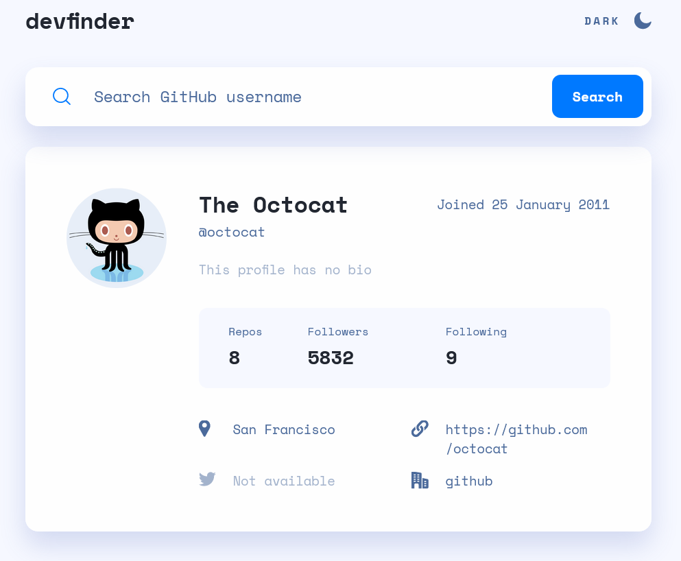

# Frontend Mentor - GitHub user search app solution

This is a solution to the [GitHub user search app challenge on Frontend Mentor](https://www.frontendmentor.io/challenges/github-user-search-app-Q09YOgaH6). Frontend Mentor challenges help you improve your coding skills by building realistic projects.

## Table of contents

- [Overview](#overview)
  - [The challenge](#the-challenge)
  - [Screenshot](#screenshot)
  - [Links](#links)
- [My process](#my-process)
  - [Built with](#built-with)
  - [What I learned](#what-i-learned)
  - [Continued development](#continued-development)
  - [Useful resources](#useful-resources)
- [Author](#author)
- [Acknowledgments](#acknowledgments)

## Overview

### The challenge

Users should be able to:

- View the optimal layout for the app depending on their device's screen size
- See hover states for all interactive elements on the page
- Search for GitHub users by their username
- See relevant user information based on their search
- Switch between light and dark themes
- **Bonus**: Have the correct color scheme chosen for them based on their computer preferences. _Hint_: Research `prefers-color-scheme` in CSS.

### Screenshot



### Links

- Solution URL: [https://github.com/nicheweb-frontend-challenges/github-user-search-app.git]
- Live Site URL: [https://jovial-raman-5b513a.netlify.app/]

## My process

### Built with

- Semantic HTML5 markup
- CSS custom properties
- Flexbox
- CSS Grid
- Mobile-first workflow
- Vanilla JavaScript(fetch | events).

### What I learned

[HTML]
I decided to embed the svg's code inside the html file in order of changing its color as needed adding a fill attribute, I also apply inline viewBox attributes for scaling at the svg's images used for the list.

```html
<svg viewBox="a b c d" xmlns="http://...svg">
  <path ... fill="#..." />
</svg>
```

[CSS]
I used a base custom list with the svg's images and headings, clearing the defaults and implementing grids and gaps

```css
ul {
  margin: 0;
  padding: 0;
  list-style: none;
  display: grid;
  gap: 1.6rem;
}

li {
  display: grid;
  grid-template-columns: 20px auto;
  gap: 20px;
}
```

[JS]
To be honest the weirdest think for me was how hovering works in touchscreen devices, specifically in the phone. So I had to check first if the pointer device was a mouse and implementing hover using javascript.

```js
if (matchMedia("(pointer:fine)").matches) {
  // Dark theme :hover
  darkTheme.addEventListener("mouseover", (event) => {
    event.currentTarget.style.color = "#222731";
  });
  darkTheme.addEventListener("mouseleave", (event) => {
    event.currentTarget.style.color =
      document.querySelector("body").style.color;
  });
  // Light theme :hover
  lightTheme.addEventListener("mouseover", (event) => {
    event.currentTarget.style.color = "#90a4d4";
  });
  lightTheme.addEventListener("mouseleave", (event) => {
    event.currentTarget.style.color =
      document.querySelector("body").style.color;
  });
}
}
```

### Continued development

Well in case of styling using js is necessary to use more classes than inline styling it is more flexible. It would be interesting work in this project using react.

### Useful resources

- (https://css-tricks.com/scale-svg/) - This helped me working to scale properly the SVG images
- (https://moderncss.dev/totally-custom-list-styles/) - This article came to save my life to solve the problem of the list (custom lists)
- (https://developer.mozilla.org/en-US/docs/Web/JavaScript/Reference/Global_Objects/Intl/DateTimeFormat/DateTimeFormat) - great to working with dates

## Author

- Website - [Norge Rojas Cerulia](https://www.your-site.com)
- Frontend Mentor - [@niche-web](https://www.frontendmentor.io/profile/niche-web)
- Twitter - [@nani45670378](https://www.twitter.com/nani45670378)

## Acknowledgments

Thank you very much to ... MYSELF 😁
